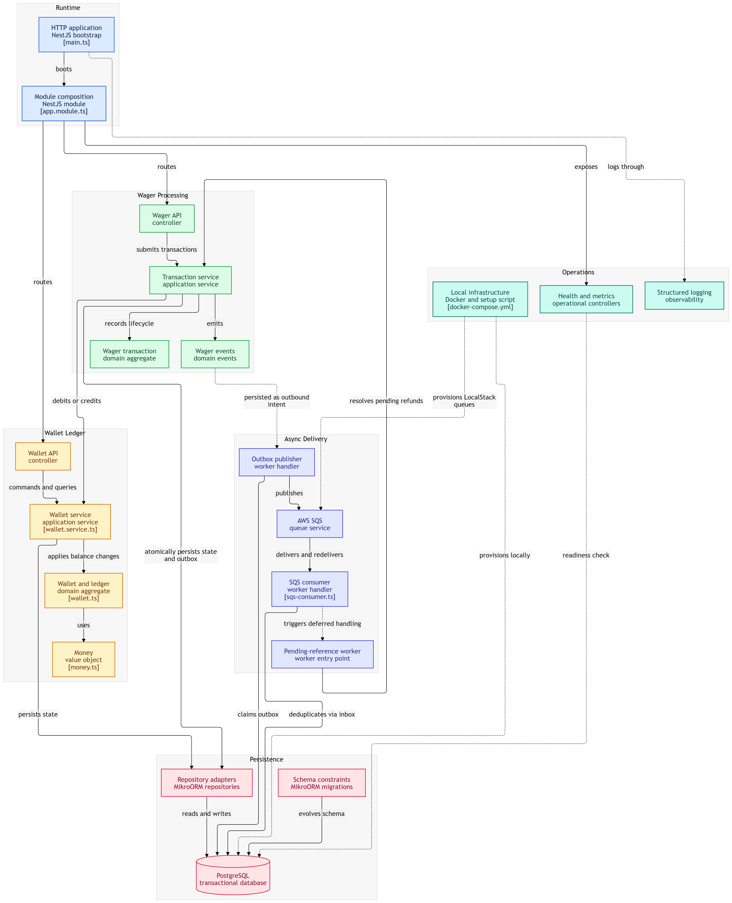

# Arquitetura — Distributed Wagering Processor

## O que esse sistema faz

Processa transações de apostas vindas de múltiplos provedores de jogos (casinos online). O sistema recebe BET, WIN, LOSS, REFUND e ROLLBACK, mantém o saldo da wallet always consistente com o ledger, e garante que nada é duplicado ou perdido — mesmo com múltiplas instâncias rodando ao mesmo tempo.

---

## Como está organizado



A aplicação segue **DDD (Domain-Driven Design)** com **Clean Architecture**. Cada domínio (wallet, wagering, shared) tem suas camadas:

```
domain/        → regras de negócio puras (aggregates, value objects, events)
application/   → use cases (services)
infrastructure/→ persistência (repositories, entities MikroORM), messaging (workers)
presentation/  → controllers HTTP
```

### Módulos

| Módulo | Responsabilidade |
|--------|-----------------|
| **WalletModule** | Criar wallet, consultar saldo, ledger, reconciliação |
| **WageringModule** | Processar transações de aposta (BET/WIN/LOSS/REFUND/ROLLBACK) |
| **SharedModule** | Inbox, Outbox, métricas, logging |
| **HealthModule** | Health checks + métricas |

---

## Decisões técnicas e por quê

### 1. MikroORM (não Prisma, não TypeORM)

O desafio exige Unit of Work + Identity Map + pessimistic locking. MikroORM entrega tudo isso nativamente com `em.transactional()` e `SELECT FOR UPDATE`. Prisma não tem Unit of Work real. TypeORM tem mas é menos maduro que MikroORM nestas features.

### 2. Dinheiro: decimal.js (nunca number/float)

Todas as quantias monetárias usam `decimal.js` com precisão fixa de 2 casas. O Money VO é imutável — toda operação retorna uma nova instância. O schema do banco usa `DECIMAL(20,2)` que é exato.

### 3. Concorrência: pessimistic locking por wallet

Cada transação financeira faz `SELECT FOR UPDATE` na wallet antes de mexer no saldo. Isso serializa operações na mesma wallet sem locks globais. Wallets diferentes continuam em paralelo.

**Por que não optimistic locking?** Com optimistic, duas instâncias que leem o mesmo saldo e tentam debitar ao mesmo tempo vão competir — uma falha e precisa retry. Em cenário de alta concorrência (hot wallet), isso gera muitas rejeições e retries. Pessimistic lock é mais previsível.

### 4. Idempotência: banco de dados (não memória)

A chave de idempotência é armazenada na tabela `wager_transactions` com constraint UNIQUE. `em.transactional()` garante que a verificação e a inserção acontecem atomicamente. Se duas requisições com a mesma chave chegam ao mesmo tempo, a constraint UNIQUE do banco é quem rejeita — não uma checagem em memória.

### 5. Transação atômica: wallet + ledger + inbox + outbox

Tudo acontece dentro de `em.transactional()`. Se qualquer passo falhar, nada é persistido. Isso inclui:
- A wallet (saldo atualizado)
- O ledger (lançamento imutável)
- O inbox (dedup para SQS)
- O outbox (evento para publicação posterior)

### 6. Outbox Pattern (Transactional Outbox)

Eventos não são publicados diretamente para SQS. Em vez disso, são gravados na tabela `outbox_messages` dentro da mesma transação financeira. Um worker (`OutboxPublisher`) faz polling e publica os eventos pendentes. Isso garante que:
- Eventos nunca são perdidos (se o processo morre, o worker da próxima instância retoma)
- Eventos nunca são publicados antes do commit
- Publicações duplicadas são seguras (consumers devem ser idempotentes)

**Fila separada:** Eventos são publicados em `wager-events.fifo`, fila separada de `wager-transactions.fifo`. Isso evita loop circular (consumer lendo eventos que ele mesmo publicou).

### 7. Inbox Pattern (dedup de SQS)

Mensagens SQS são deduplicadas via `inbox_messages` (PK: consumer_name + message_id). O consumer grava o inbox ANTES de processar, e marca como processado DEPOIS do commit. Se a mensagem chegar de novo (redelivery), o inbox já existe e o processamento é ignorado.

### 8. PENDING_REFERENCE com backoff exponencial

Transações que dependem de uma referência (REFUND/ROLLBACK) entram em `PENDING_REFERENCE` se a referência ainda não existe. Um worker periodicamente tenta resolver essas pendências com backoff exponencial (1s → 2s → 4s → ... → 5min). Após 10 tentativas (~17 minutos), a transação é rejeitada com `REFERENCE_NOT_FOUND`.

### 9. Schema do banco: constraints em tudo

As invariantes estão no banco, não só no código:
- `CHECK (balance >= 0)` — wallet nunca fica negativa
- `CHECK (amount >= 0)` — quantias sempre positivas
- `CHECK (direction IN ('DEBIT', 'CREDIT'))` — só duas direções
- `CHECK (kind IN (...))` — só tipos válidos
- `UNIQUE (player_id, currency)` — uma wallet por jogador por moeda
- `UNIQUE (wallet_id, transaction_id)` — um lançamento por wallet por transação
- `UNIQUE (idempotency_key)` — idempotência
- `UNIQUE (provider_id, external_transaction_id)` — referência única por provedor
- `CHECK (ledger_arithmetic_check)` — saldo anterior ± valor = saldo posterior
- Trigger `prevent_ledger_update()` — ledger imutável (não pode UPDATE)
- Trigger `prevent_ledger_delete()` — ledger imutável (não pode DELETE)

### 10. Logging em JSON

Todos os logs saem em formato JSON estruturado com `correlationId`, `transactionId`, `walletId`, `providerId`. Isso permite busca e correlação em ferramentas como Datadog, ELK, CloudWatch.

### 11. Métricas in-memory (Prometheus-ready)

Contadores e histogramas ficam no `MetricsService`. Endpoint `/metrics` expõe tudo. Em produção, isso se conectaria ao Prometheus. Por agora, serve para diagnóstico durante o desafio.

### 12. Autenticação: não implementada (decisão documentada)

O desafio diz que autenticação não vale pontos e não deve competir com correção financeira. Em produção, eu usaria Keycloak com OIDC + AuthGuard do NestJS. O ponto de extensão fica explícito: basta adicionar um `AuthGuard` nos controllers.

---

## O que NÃO foi implementado (e por quê)

| Item | Motivo |
|------|--------|
| Keycloak/IdP | Não vale pontos, decidi focar em correção financeira |
| Dashboard Grafana | Diferencial, não requisito |
| Teste de carga | Diferencial, não requisito |
| Multi-moeda completa | O desafio assume BRL, mas o modelo é multi-moeda |

---

## Trade-offs

1. **Pessimistic vs Optimistic locking**: Escolhi pessimistic porque é mais previsível em hot wallet. O custo é que operações na mesma wallet são serializadas — mas isso é o correto financeiramente.

2. **Outbox polling vs CDC**: Polling é mais simples e não depende de WAL/LDMS. Para o volume deste desafio, polling a cada 2s é suficiente. Em produção de alto volume, usaria CDC (Change Data Capture).

3. **Métricas in-memory vs Prometheus**: In-memory é temporário e perde no restart. Mas para o escopo do desafio, funciona. Em produção, integraria com Prometheus.

4. **maxRetries=10 com TTL**: Justificado: com backoff exponencial (1s, 2s, 4s, 8s, 16s, 32s, 64s, 128s, 256s, 300s), a janela total é de ~17 minutos. Se a referência não chegar nesse tempo, provavelmente nunca chegará.

---

## Limitações conhecidas

- Métricas são in-memory (perdem-se no restart)
- Sem autenticação (ponto de extensão pronto)
- Sem dashboard de monitoramento
- DLQ não tem consumer (mensagens ficam lá para inspeção manual)
- Worker de retry usa polling (não event-driven)
